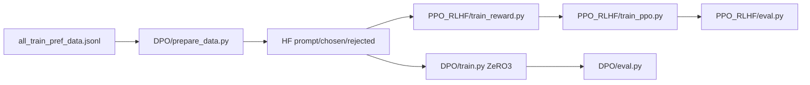

# DPO / PPO-RLHF Baselines under math_reasoning

## Session system prompt

1. Read this root `Project_plan.md` (Goal, map, locked decisions, active subtask deep brief, Progress log).
2. Work **only** the active pending subtask (first pending todo, or the id the user names).
3. Do not reopen locked decisions unless the user explicitly asks.
4. Before editing: open files named in that subtask’s deep brief; understand the call graph.
5. Product under [`math_reasoning/recipes/`](math_reasoning/recipes/) only. Do not modify `pita_vllm/` for this Goal.
6. Reuse by `cp` then edit: eval from `v1_eval_base_model.py`, accelerate YAMLs from pita_vllm/SPPO, RM from `train_reward_model_hf.py`.
7. Params via Hydra/YAML; tqdm for long work; no placeholders; no LoRA/4-bit for DPO policy.
8. Before ending: mark subtask completed/blocked; append Progress log; handoff `subtask_id | done|blocked | next_pending_id`.
9. **Active subtask right now:** none (S1 and S2 completed)

## Goal

Ship comparable **policy** baselines against PITA on GSM8K preference data: complete **full-parameter DPO** end-to-end (prep → train → eval → metrics), then **PPO/RLHF** (1B reward + 1B value, 8B policy).

## Preference data

- Source: `math_reasoning/collected_data/llama_3_8b_instruct_gsm8k/all_train_pref_data.jsonl`
- Split: `math_reasoning/dataset/gsm8k_train_eval.json` (train 6726 / eval 747)
- Prepared: `math_reasoning/recipes/DPO/data` — **107616** train / **11952** eval pairs
- Pair rule: if `partial_guided_predictions_correctness[j]` then chosen=partial else chosen=full

## Architecture / codebase map

```text
math_reasoning/recipes/
  requirements.txt          # use conda env arpo (trl==0.9.6)
  DPO/
    configs/{train,eval}.yaml
    configs/accelerate/deepspeed_zero3.yaml
    prepare_data.py         # pref jsonl → HF DatasetDict
    train.py                # TRL DPOTrainer full FT
    eval.py                 # GSM8K/MATH policy eval
    launch.sh / launch_eval.sh
    data/                   # prepared pairs
  PPO_RLHF/
    configs/{train_reward,train_ppo,eval}.yaml
    configs/accelerate/{deepspeed_zero3,multi_gpu}.yaml
    prepare_data.py         # symlink → DPO/data
    train_reward.py         # 1B pairwise RM
    train_ppo.py            # 8B policy + 1B reward + 1B value
    eval.py
    launch_reward.sh / launch_ppo.sh / launch_eval.sh
    data -> recipes/DPO/data
```



## Locked decisions

- Scope: `math_reasoning/recipes/` only
- Folders: `DPO/`, `PPO_RLHF/`
- DPO policy+ref: `meta-llama/Meta-Llama-3-8B-Instruct`, full FT, no LoRA
- Stack DPO: TRL DPOTrainer + Accelerate DeepSpeed ZeRO-3, bf16, 8 processes
- PPO: policy 8B; reward and value = `meta-llama/Llama-3.2-1B-Instruct`
- Ignore legacy `train_classifier_dpo*.py`

## How to run (from `math_reasoning/`, env `arpo`)

```bash
# DPO
python recipes/DPO/prepare_data.py
bash recipes/DPO/launch.sh
bash recipes/DPO/launch_eval.sh
python aggregate_efficiency_stats.py --efficiency_log_dir checkpoints/llama_3_8b_instruct_gsm8k/dpo_full/efficiency

# PPO/RLHF
python recipes/PPO_RLHF/prepare_data.py
bash recipes/PPO_RLHF/launch_reward.sh
bash recipes/PPO_RLHF/launch_ppo.sh
bash recipes/PPO_RLHF/launch_eval.sh
```

## Subtasks

### S1 — DPO full pipeline — completed

Full-model DPO prep/train/eval/launch + efficiency hooks; PPO folder scaffolded then filled in S2.

### S2 — PPO/RLHF pipeline — completed

1B pairwise reward model; Accelerate MULTI_GPU PPO with 8B policy, frozen 1B RM, trainable 1B value; shared eval + efficiency schema.

## Progress log

### 2026-07-30 — S1-dpo-pipeline — completed

Changes:
- Created `math_reasoning/recipes/DPO/` with Hydra configs, ZeRO-3 accelerate yaml, `prepare_data.py`, `train.py` (TRL DPOTrainer), `eval.py` (cp from `v1_eval_base_model.py`), launch scripts.
- Prepared dataset: 107616 train / 11952 eval pairs under `recipes/DPO/data`.
- Efficiency callback writes `efficiency/run_metadata.json` + `train_step_metrics.jsonl` for `aggregate_efficiency_stats.py`.
- Wrote root `Project_plan.md`.

Follow-ups: run full 8-GPU DPO training on H200 node when scheduled.

Next: `S2-ppo-rlhf`

### 2026-07-30 — S2-ppo-rlhf — completed

Changes:
- `train_reward.py`: pairwise logistic RM on 1B Instruct via Accelerate/DeepSpeed.
- `train_ppo.py`: custom PPO loop (8B policy + frozen 1B reward + trainable 1B value), MULTI_GPU accelerate.
- Launch scripts for reward/PPO/eval; data symlink to DPO prepared pairs.

Follow-ups: tune PPO `num_iterations` / KL on first real run; confirm RM path before PPO launch.

Next: none

### 2026-07-30 — S1-dpo-pipeline — completed

Changes:
- Fixed startup SIGKILL caused by loading two complete 8B models on every rank before DeepSpeed initialization.
- Added a Trainer DeepSpeed JSON config and now constructs `DPOConfig` before `from_pretrained`, activating `zero.Init` during policy and reference-model loading.
- Enabled low-memory checkpoint loading and ZeRO-3-aware parameter counts.

Follow-ups: rerun `bash recipes/DPO/launch.sh` on the 8× H200 allocation.

Next: none

### 2026-07-30 — S1-dpo-pipeline — completed

Changes:
- Removed duplicate ZeRO, offload, and precision fields from the Accelerate YAML.
- The Accelerate launcher now references the single Trainer DeepSpeed JSON config, avoiding configuration validation conflicts.

Follow-ups: rerun the same DPO launch command.

Next: none

### 2026-07-30 — S1-dpo-pipeline — completed

Changes:
- Enabled W&B logging under project `pita-dpo` with run name `dpo_full_gsm8k`.
- Suppressed repetitive `transformers.trainer` deprecation warnings while retaining errors and progress output.
- Set DPO dataset tokenization to one process to avoid pickling the initialized NCCL process group.

Follow-ups: restart the DPO run; W&B authentication already exists in the environment.

Next: none

### 2026-07-30 — S1-dpo-pipeline — completed

Changes:
- Removed 11 GB of failed and duplicate tokenization cache files while preserving the 145 MB prepared preference dataset.
- Added a lightweight, serializable DPO tokenization state so every rank computes the same dataset fingerprint.
- Restored eight preprocessing workers: rank 0 writes one shared sharded cache and remaining ranks reuse it.

Follow-ups: rerun DPO; expected tokenization cache growth is approximately 1.5 GB rather than one copy per rank.

Next: none

### 2026-07-30 — S1-dpo-pipeline — completed

Changes:
- Added compatibility adapters for TRL 0.9.6 with Transformers 4.51 (`get_batch_samples` and `compute_loss` signatures).
- Verified the actual 8× H200 run reached optimizer step 1/840 under DeepSpeed ZeRO-3.
- Confirmed W&B synchronization and shared dataset-cache reuse.

Follow-ups: allow the active DPO training run to complete.

Next: none
