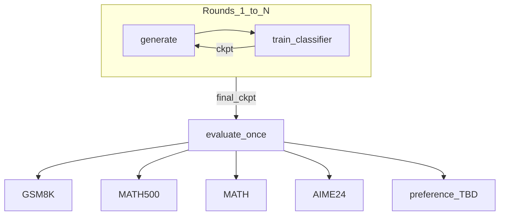

# PITA Refactor

## Session system prompt

1. Read this root `Project_plan.md` (Goal, map, locked decisions, active subtask deep brief, Progress log).
2. Work **only** the active pending subtask (first pending todo, or the id the user names).
3. Do not reopen locked decisions unless the user explicitly asks.
4. Before editing: open files named in that subtask’s deep brief; understand the call graph.
5. **Ground-up product:** the runnable pipeline lives only under `refactor/`. Do **not** import from, call into, or ship against `math_reasoning/`, SPPO, or `verl-tool-lens` as runtime dependencies.
6. **Reuse by copy:** when borrowing reference code, **`cp` the file(s) into `refactor/`**, then edit in place. Do not regenerate large known-good modules from scratch (wastes tokens). Do not modify the reference trees for PITA features.
7. Reference sources for borrow/copy: `math_reasoning/` (PITA algorithm), SPPO (preference data/engine patterns), [`verl-tool-lens/benchmarks/math-evaluation-harness`](verl-tool-lens/benchmarks/math-evaluation-harness) (math parse/grade + eval JSONLs @ `9271e69`).
8. Minimal diffs after copy; params via Hydra; tqdm for long work; no placeholders.
9. Design until a subtask’s Done-when says otherwise. Prefer locking decisions here over premature code.
10. Before ending: mark subtask completed/blocked; append Progress log; handoff `subtask_id | done|blocked | next_pending_id`.
11. Do not invent long S2/S3 roadmaps as shallow stubs. Add later subtasks here with full deep briefs when named.
12. **Active subtask right now:** `S1-eval-datasets`

## Goal

Refactor PITA into a maintainable package under [`refactor/`](refactor/):

```text
for round in 1..N:          # N from config
    generate training data  # classifier from prior round (η=0 / zero on round 1)
    train classifier
once:
    evaluate final classifier on fixed held-out eval suites
```

| Family | Role | Train / generate (rounds) | Final eval (once) |
|--------|------|---------------------------|-------------------|
| **Preference** (primary) | SPPO-sourced prefs / prompts | SPPO UltraFeedback-derived pipeline | TBD in S1 (proposal: AlpacaEval 2) |
| **Arithmetic** (special case) | Guided math | **DAPO-MATH-17K** | **GSM8K, MATH500, MATH, AIME24** |

**Deferred:** AIME25 (add in a later subtask; not in current harness / not blocking S1).

DeepSpeed may later be the training engine; it is **not** the Goal.

**Build mode:** entire pipeline is owned under `refactor/` (ground-up packaging and wiring). Existing scaffold in [`refactor/todo.md`](refactor/todo.md) and reference trees are **borrow sources** — copy useful files into `refactor/`, then edit; do not leave the product coupled to those repos.

## Architecture / codebase map

### Algorithm

Legacy truth: [`math_reasoning/`](math_reasoning/) — N-round gen+train (manual CLIs); eval once (`eval_ckpt*.py`). Preference legacy used HH/Alpaca; Goal preference moves to SPPO sources.

### Refactor scaffold

```text
cli.generate → generation/ (Ray) → parquet
cli.train    → training/ (Accelerate) → ckpt_*
cli.eval     → eval/ + scoring/
```

### Math eval harness (borrow source — verified on disk)

Reference only (not a runtime dependency): [`verl-tool-lens/benchmarks/math-evaluation-harness`](verl-tool-lens/benchmarks/math-evaluation-harness) @ `9271e69` (submodule initialized).

When implementing math eval under `refactor/`: **`cp`** needed modules/data into `refactor/`, then edit (Hydra paths, guided-decode outputs, package imports). Do not `import` from the submodule in shipped code.

| Reference module | Copy/adapt into `refactor/` for |
|------------------|----------------------------------|
| [`parser.py`](verl-tool-lens/benchmarks/math-evaluation-harness/parser.py) | `extract_answer`, `parse_ground_truth`, `parse_question`, `strip_string` |
| [`grader.py`](verl-tool-lens/benchmarks/math-evaluation-harness/grader.py) | `math_equal` / process-pool grading |
| [`evaluate.py`](verl-tool-lens/benchmarks/math-evaluation-harness/evaluate.py) | Offline grade → `acc` / `max_acc` |
| [`data_loader.py`](verl-tool-lens/benchmarks/math-evaluation-harness/data_loader.py) + [`data/`](verl-tool-lens/benchmarks/math-evaluation-harness/data/) | Eval JSONL loaders / vendored benches |
| [`math_eval.py`](verl-tool-lens/benchmarks/math-evaluation-harness/math_eval.py) | Pipeline shape only — do not require its vLLM path for PITA guided eval |

**Owned in `refactor/` after copy:** parse/grade, eval JSONLs (or copied data), Hydra CLIs, guided generation, Ray, train.  
Harness metrics to preserve after copy: `acc` ≈ pass@1; `max_acc` ≈ pass@k. No maj@k in harness (legacy PITA had it — decide later).

### Arithmetic data (locked for v1)

**Train / generate only:** DAPO-MATH-17K — Hub [`BytedTsinghua-SIA/DAPO-Math-17k`](https://huggingface.co/datasets/BytedTsinghua-SIA/DAPO-Math-17k). Not an eval set; not in the harness.

**Final eval (once) — all JSONLs present locally:**

| Bench | `data_name` | Path under harness | n | Sample fields |
|-------|-------------|--------------------|--:|---------------|
| GSM8K | `gsm8k` | [`data/gsm8k/test.jsonl`](verl-tool-lens/benchmarks/math-evaluation-harness/data/gsm8k/test.jsonl) | 1319 | `question`, `answer` |
| MATH500 | `math500` | [`data/math500/test.jsonl`](verl-tool-lens/benchmarks/math-evaluation-harness/data/math500/test.jsonl) | 500 | `problem`, `solution`, `answer`, … |
| MATH | `math` | [`data/math/test.jsonl`](verl-tool-lens/benchmarks/math-evaluation-harness/data/math/test.jsonl) | 5000 | `problem`, `solution`, `level`, `type` |
| AIME24 | `aime24` | [`data/aime24/test.jsonl`](verl-tool-lens/benchmarks/math-evaluation-harness/data/aime24/test.jsonl) | 30 | `problem`/`question`, `answer`, … |

**Out of v1 scope:** AIME25; harness extras (Minerva, Olympiad, AMC23).  
**Retired as train sources:** legacy `math_reasoning/dataset/gsm8k_train*`, `math_train*`.

### Preference (open)

SPPO train/gen: UCLA-AGI UltraFeedback-derived iters. SPPO has no real held-out pref test.  
Proposed final eval: **AlpacaEval 2** — awaiting confirm.

### Hydra sketch (design — implement later)

Separate **round data** from **one-shot eval suites**:

```yaml
# conceptual — not implemented yet
dataset:
  family: arithmetic   # or preference
  train:
    name: dapo_math_17k
    source: BytedTsinghua-SIA/DAPO-Math-17k
  eval_suites:         # run once after last round
    - gsm8k
    - math500
    - math
    - aime24
# preference: train from SPPO sources; eval_suites: [alpaca_eval] once locked
```

Today’s [`refactor/configs/dataset/*.yaml`](refactor/configs/dataset/) collapse train+eval — replace when implementing.



## Locked decisions

- Framing: **PITA refactor** (DeepSpeed = candidate engine later).
- Loop: **gen + train for N rounds; eval once**.
- Preference primary; arithmetic special case.
- Preference train/gen from **SPPO** sources (not HH long-term).
- **Ground-up under `refactor/`:** we do **not** use reference repos as the product (no runtime imports/subprocess into `math_reasoning/`, SPPO, `verl-tool-lens`). Build the full pipeline ourselves.
- **Reuse = copy then edit:** prefer `cp` of reference files into `refactor/`, then modify; do not regenerate wholesale; do not edit reference trees for PITA features.
- Math eval borrow list: harness `parser` / `grader` / `evaluate` / `data_loader` / `data/{gsm8k,math500,math,aime24}`; guided decode owned in `refactor/`.
- Arithmetic **train:** DAPO-MATH-17K only.
- Arithmetic **eval (v1):** GSM8K, MATH500, MATH, AIME24 — copy from harness table paths above (or re-host under `refactor/` data).
- **AIME25 deferred** — do not block S1 or v1 math-eval work.
- Preference final eval: AlpacaEval 2 proposed, **unconfirmed**.

## Gaps vs current `refactor/`

- No DAPO-MATH-17K loader; dataset YAMLs still GSM8K/MATH/HH/AlpacaFarm.
- [`refactor/scoring/arithmetic.py`](refactor/scoring/arithmetic.py) ≠ harness `math_equal`.
- `cli.eval` arithmetic path is single-dataset legacy-shaped; no multi-suite harness benches.
- Preference configs still HH / AlpacaFarm / HH-PPL.
- No N-round orchestrator.

## Subtasks

### S1 — `S1-eval-datasets` — Lock evaluation (+ arithmetic train) datasets

**Status:** `pending` (design)

#### Goal / why

Finish the dataset + harness boundary lock before implementation subtasks (loaders, multi-bench eval, SPPO prefs, orchestration).

#### Read first

- Harness (on disk): `parser.py`, `grader.py`, `evaluate.py`, `data_loader.py`, `data/{gsm8k,math500,math,aime24}/test.jsonl`
- [`verl-tool-lens/benchmarks/README.md`](verl-tool-lens/benchmarks/README.md)
- [`math_reasoning/eval_ckpt.py`](math_reasoning/eval_ckpt.py) — guided-decode contrast
- [`refactor/eval/arithmetic.py`](refactor/eval/arithmetic.py), [`refactor/scoring/arithmetic.py`](refactor/scoring/arithmetic.py), [`refactor/configs/dataset/`](refactor/configs/dataset/)
- [`SPPO/README.md`](SPPO/README.md) Evaluation (preference)

#### Do

1. Keep Locked decisions + tables above as source of truth (amend only if user changes names).
2. Confirm or defer preference final-eval (AlpacaEval 2).
3. Finalize Hydra `train` vs `eval_suites` sketch (section above); note replacement of current dataset YAMLs.
4. List which harness/legacy files will be **`cp`’d into `refactor/`** in the first coding subtask (paths + target dirs) — design only in S1.
5. Keep AIME25 deferred.

#### Do not

- Do not implement DeepSpeed, loaders, or N-round orchestrator in S1.
- Do not leave math eval calling into the submodule at runtime.
- Do not modify reference repos (`verl-tool-lens/`, `math_reasoning/`, SPPO) for PITA features.
- Do not regenerate large borrowable modules from scratch when a `cp` + edit would do.
- Do not work on AIME25 now.
- Do not treat DAPO-MATH-17K or SPPO `test.parquet` as final eval.

#### Done when

- Arithmetic train + v1 eval matrix + harness boundary are locked (largely done after this redo).
- Preference eval confirmed **or** explicitly deferred with a named follow-up.
- Progress log reflects submodule init + AIME25 deferral.

#### Depends on

Preference eval confirm (optional to complete S1 if deferred by name).

## Progress log

### Template

```
### YYYY-MM-DD — <subtask-id> — completed|blocked
- Changes: ...
- Follow-ups: ...
- Next: <subtask-id or none>
```

### Entries

### 2026-07-14 — plan history (compressed)
- Was: DeepSpeed-framed plan → reframed to PITA refactor; DAPO-MATH-17K train; multi-bench eval; harness as reference while submodule empty.
- Next: redo below.

### 2026-07-14 — S1-eval-datasets — design (plan redo)
- Changes: **Redid plan** after submodule init. Verified harness @ `9271e69` with local counts: gsm8k 1319, math500 500, math 5000, aime24 30. **AIME25 deferred**. Locked v1 arithmetic eval benches. Hydra sketch + gaps documented.
- Follow-ups: Ground-up / copy-reuse rule (next entry).
- Next: `S1-eval-datasets`

### 2026-07-14 — S1-eval-datasets — design (ground-up + copy)
- Changes: Locked build mode: **entire pipeline ground-up in `refactor/`**; reference repos are **borrow sources only** (not runtime deps). Reuse = **`cp` into `refactor/` then edit**; do not regenerate large known modules; do not patch reference trees for PITA.
- Follow-ups: Confirm/defer preference final-eval; list concrete `cp` targets; then close S1 or name first coding subtask.
- Next: `S1-eval-datasets`
