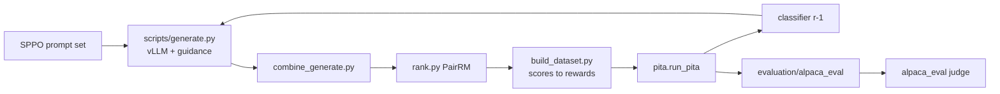

# PITA on AlpacaEval

## Session system prompt

1. Read this file (Goal, map, locked decisions, active subtask, Progress log).
2. Work **only** the active pending subtask (first pending todo, or the id named).
3. **`pita/` is the only writable tree.** `SPPO/`, `refactor_old/`, `math_reasoning/`,
   `verl-tool-lens/` are read-only reference.
4. **Reuse by `cp` then edit.** Never retype or regenerate a known-good module; copy it
   and apply a minimal diff. Name the source in the module docstring.
5. **No environment work.** Conda envs and package installs are the user's. Declare
   dependencies; do not install them. Read-only inspection of envs is fine.
6. Keep it one designed codebase: clean configs, one trainer, one generation path, no
   dead placeholders.
7. Before ending: mark the subtask, append to the Progress log.
8. **Active subtask right now:** `S2-gpu-bringup`

## Goal

PITA ([arXiv:2507.20067](https://arxiv.org/abs/2507.20067)) freezes the LLM and trains a
small value classifier that tilts token logits at inference time, learning directly from
preference feedback with no reward model.

```text
for round in 1..3:
    sample K=5 responses/prompt   # frozen policy, guided by classifier_{r-1}
    rank with PairRM              # preference feedback
    reward = Bradley-Terry win rate
    train classifier_r
once:
    AlpacaEval 2                  # held-out LC win rate
```

Round 1 samples unguided (`eta=0`); later rounds sample under the previous classifier, so
the training distribution tracks the policy guidance actually produces. Prompt sets are
SPPO's `UCLA-AGI/data-mistral-7b-instruct-sppo-iter{1,2,3}`, which makes the AlpacaEval
number directly comparable to SPPO's published Llama-3-8B result.

**Baselines to beat:** unguided `eta=0` (same code path, no classifier loaded), and
SPPO's Llama-3-8B-Instruct-SPPO-Iter3.

## Architecture / codebase map

```text
pita/                        <- the only writable tree
  pita/
    classifier.py   ValueClassifier: AutoModel backbone + Q or V value head
    guidance.py     PITAGuidedLogitsProcessor (vLLM V1) + BankCache
    masking.py      4D attention masks, plain torch
    data.py         ranked generations -> training tensors
    trainer.py      Accelerate loop (DDP)
    configs.py      dataclasses + YAML/CLI parser
    run_pita.py     training entry
  scripts/          generate combine preload rank build_dataset (+ generate.sh pipeline.sh)
  recipes/          accelerate_configs/ + pita/{llama3,qwen25,ministral}.yaml
  evaluation/alpaca_eval/generate.py
  tests/            33 CPU tests
  run_pita_llama-3.sh
```



### Reference trees (read-only, borrow by cp)

| Path | What it is |
|------|------------|
| `SPPO/` | Infra shape: generate/rank/pipeline scripts, accelerate configs, arg parser |
| `refactor_old/` | Previous standalone refactor: classifier, guidance math, trainer |
| `math_reasoning/` | Original research code; `my_alpaca_eval_code/` has the AlpacaEval writer |
| `verl-tool-lens/` | Unrelated |

## Locked decisions

- Product root **`pita/`**; reference trees read-only, reuse by `cp` then edit.
- **On-policy rounds**, not the legacy offline AlpacaFarm relabeling — that path never ran
  the loop at all (generation is commented out in `collect_training_data_alpaca.py`).
- **vLLM V1 custom logits processor** for guidance. One generation path; `eta=0` means
  unguided and loads no classifier.
- **Model-agnostic**: backbone composed via `AutoModel`, no per-arch subclass or registry,
  masks built locally, `apply_chat_template` instead of model-name sniffing, head width
  from the **reference** `config.vocab_size`. Adding a family is one YAML.
- The only structural constraint: policy and classifier must **share a tokenizer**.
  `validate_pair` checks the real vocabularies at startup.
- **Q head default**, V supported. Q scores all candidates in one forward; V costs ~`top_k`x.
- Reward = **Bradley-Terry win rate** (soft BCE target); `--binarize` for SPPO-style pairs.
- Plain **DDP**, no DeepSpeed — the trainable model is <=2B.
- Infra mirrors SPPO (argparse + YAML recipes + shell drivers), not Hydra.
- Generation and judging are **separate steps**; AlpacaEval only needs `model_outputs.json`.

## Environment

Use the existing **`pita`** conda env
(`/scratch/user/saratb_tamu.edu/miniconda3/envs/pita`): vLLM 0.11.0, torch 2.8.0,
transformers 5.12.1, flash-attn 2.8.1, accelerate 1.14.0. All verified present, and the
33 CPU tests pass in it.

**Do not use SPPO's env.** It pins `torch==2.1.2` / `transformers==4.42.4` / `trl==0.9.6`,
which predate the vLLM V1 logits-processor API this project is built on.

Still to install:

| Package | For | Note |
|---|---|---|
| `alpaca-eval` | judging | needs `OPENAI_API_KEY` |
| `llm-blender` | PairRM ranking | may pin `transformers<5`; if it fights the main env, put it in its own env — `scripts/rank.py` already runs as a separate process |

## Upstream defects fixed (do not reintroduce)

1. **`expectation` guidance offset.** `refactor_old/models/guidance.py:84-86` and all three
   `math_reasoning` classifier variants clamp the *odds ratio* to `<= 1-1e-6`, forcing
   every offset non-positive — guidance could only suppress tokens, never boost them. The
   correct offset is `eta * z`, since `sigmoid(z)/(1-sigmoid(z)) == exp(z)`. Regression
   test in `tests/test_guidance_cache.py`. Every shipped `expectation` number upstream is
   suspect, including `checkpoints/alpaca/`.
2. **Pad leakage.** Upstream stored the already-padded prompt row and the collator marked
   those pads as attended. Prompts are tokenized unpadded; batches are right-padded, which
   also fixes the position-id shift left padding caused silently.

## Subtasks

### S1 — `S1-package` — completed

Full package built and committed (`7a9313c`). 33 CPU tests pass.

### S2 — `S2-gpu-bringup` — pending

#### Goal

First run on a GPU node. Nothing in the vLLM engine path has executed yet.

#### Do

1. **Guidance parity.** Greedy-decode ~16 prompts two ways: the vLLM processor, and a
   plain HF loop driving the same classifier. Token sequences must match exactly. This is
   the one test that catches cache desync inside a live engine — a desynced cache does not
   crash, it quietly degrades guidance. Keep the HF loop a test fixture, never a backend.
2. **Engine wiring.** Confirm `additional_config["pita"]` reaches the processor inside the
   engine-core process, that `max_num_seqs x max_model_len` KV bank fits alongside vLLM at
   `--gpu_memory_utilization 0.80`, and that `apply()` row indices line up with tracked
   slots under real continuous batching.
3. **Tiny end-to-end.** ~200 prompts, K=2, 1 round, 1 GPU: generate -> rank -> build ->
   train -> 20-prompt AlpacaEval generation.

#### Watch for

- vLLM 0.11.0 against transformers 5.12.1 — imports and the API check out, but full engine
  startup is untested.
- `recipes/pita/ministral.yaml` carries unverified model ids
  (`mistralai/Ministral-3-{8B,3B}-Instruct-2512`). `validate_pair` fails loudly if wrong.
- Classifier dtype/attn: the backbone is forced to `sdpa` because the 4D masks we build are
  not expressible in flash-attn.

#### Done when

Parity holds and one tiny round completes end to end.

### S3 — `S3-full-run` — pending

3 rounds on 8x H200 via `run_pita_llama-3.sh`, then AlpacaEval 805 with an eta sweep
(`0 0.5 1 2 4`), judged with `weighted_alpaca_eval_gpt4_turbo`. Compare LC win rate
against `eta=0` and SPPO's published number.

## Progress log

### 2026-09-17 — S1-package — completed

Changes:
- Renamed `pita_vllm/` -> `pita/`, dropped the unused `train/`+`evaluation/` scaffold.
- Built the package: model-agnostic `ValueClassifier`, vLLM V1 `PITAGuidedLogitsProcessor`
  with a self-healing left-aligned KV bank, data/trainer/configs, SPPO-shaped scripts and
  shell drivers, three recipe YAMLs, AlpacaEval generation, 33 CPU tests.
- Fixed the two upstream defects above rather than porting them.
- Deleted the stale DPO/PPO baseline plan and `refactor_old/todo.md`; one plan per repo.

Design note: the classifier cache is treated as pure optimization — each step every row
recomputes `len(prompt_tok_ids) + len(output_tok_ids)` and replays what it has not
consumed, so new requests, preemption and recompute all take one path and nothing depends
on vLLM's scheduling internals.

Follow-ups: everything in S2 — no GPU code path has run.

Next: `S2-gpu-bringup`
