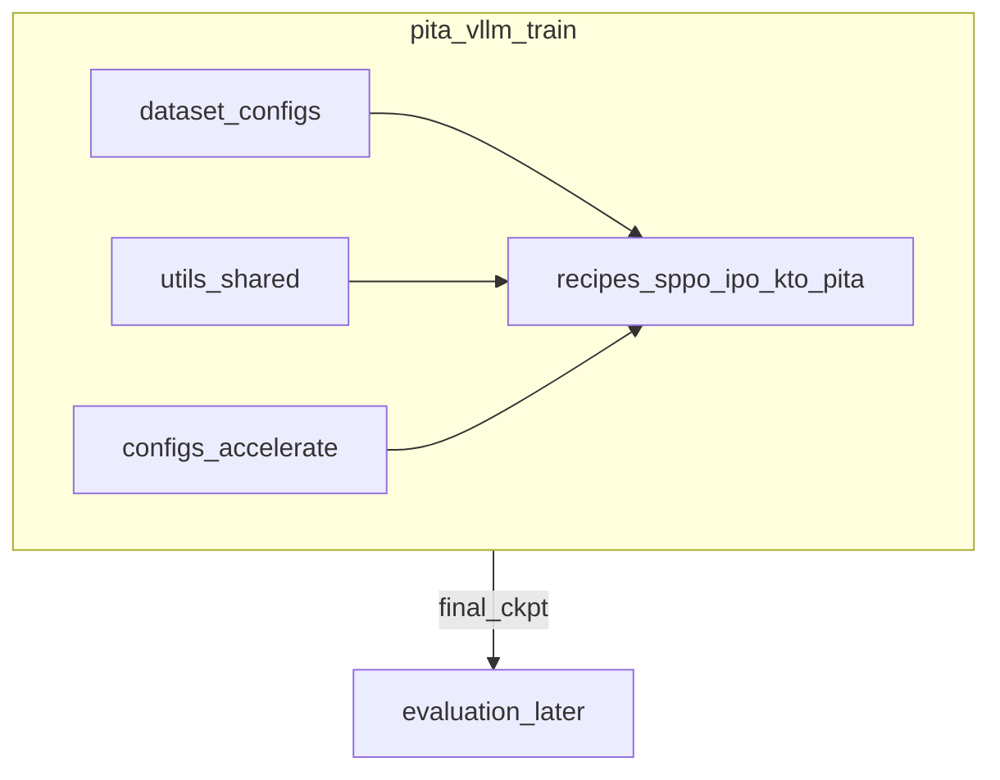

# PITA Refactor

## Session system prompt

1. Read this root `Project_plan.md` (Goal, map, locked decisions, active subtask deep brief, Progress log).
2. Work **only** the active pending subtask (first pending todo, or the id the user names).
3. Do not reopen locked decisions unless the user explicitly asks.
4. Before editing: open files named in that subtask’s deep brief; understand the call graph.
5. **Product under `pita_vllm/`:** runnable code lives only there. Do **not** import/runtime-call `SPPO/`, `refactor_old/`, `math_reasoning/`, or `verl-tool-lens/`.
6. **Layout:** top-level `train/` and `evaluation/` — self-contained. Do **not** mirror SPPO folder hierarchy wholesale; borrow useful pieces by `cp` into the new layout.
7. **Reuse by copy:** `cp` from reference trees into `pita_vllm/`, then edit. Do not regenerate large known-good modules; do not modify reference trees for PITA features.
8. Reference borrow sources: **SPPO** (generate/rank/train orchestration, Accelerate/DeepSpeed recipes, env baseline), **`refactor_old/`** + **math_reasoning** (classifier + guided logits — reference only), **math-evaluation-harness** (math eval later, under `evaluation/`).
9. Minimal diffs after copy; params via Hydra/YAML; tqdm for long work; no placeholders.
10. Design until a subtask’s Done-when says otherwise. Prefer locking decisions here over premature code.
11. Before ending: mark subtask completed/blocked; append Progress log; handoff `subtask_id | done|blocked | next_pending_id`.
12. Do not invent long S2/S3 roadmaps as shallow stubs. Add later subtasks here with full deep briefs when named.
13. **Active subtask right now:** `S1-pipeline-design`

## Goal

Ship PITA under [`pita_vllm/`](pita_vllm/) with a clean train/eval split:

```text
for round in 1..N:          # N from config
    generate training data  # classifier from prior round (η=0 / zero on round 1)
    train classifier
once:
    evaluate final classifier on fixed held-out eval suites
```

| Family | Role | Train / generate (rounds) | Final eval (once) |
|--------|------|---------------------------|-------------------|
| **Preference** (primary) | SPPO-sourced prefs / prompts + multi-model baselines | SPPO UltraFeedback-derived iters | **AlpacaEval 2** |
| **Arithmetic** (later) | Guided math | **DAPO-MATH-17K** | **GSM8K, MATH500, MATH, AIME24** |

**Preference baselines — ref + guidance pairs (dataset-agnostic):**

| Baseline | Ref (policy / generate) | Guidance (classifier) |
|----------|-------------------------|------------------------|
| llama | `meta-llama/Meta-Llama-3-8B-Instruct` | `meta-llama/Llama-3.2-1B-Instruct` |
| qwen | `Qwen/Qwen2.5-7B-Instruct` | `Qwen/Qwen2.5-1.5B-Instruct` |
| mistral | `mistralai/Ministral-3-8B-Instruct-2512` | `mistralai/Ministral-3-3B-Instruct-2512` |

Prompt Hub (preference rounds): `UCLA-AGI/data-mistral-7b-instruct-sppo-iter{1,2,3}`.

**Build mode:** `pita_vllm/train` and `pita_vllm/evaluation` are separate trees. Algorithms under `train/recipes/{sppo,ipo,kto,pita}`. Shared code in `train/utils`; shared launch/infra configs in `train/configs`; dataset configs in `train/dataset`. Reference trees are borrow-only.

## Architecture / codebase map

### Product root vs references

| Path | Role |
|------|------|
| [`pita_vllm/`](pita_vllm/) | **Product** |
| [`pita_vllm/train/`](pita_vllm/train/) | All training / data-gen for rounds — self-contained |
| [`pita_vllm/evaluation/`](pita_vllm/evaluation/) | Final eval only — hierarchy deferred |
| [`SPPO/`](SPPO/) | Borrow: env baseline, accelerate YAMLs, generate/rank/pipeline patterns |
| [`refactor_old/`](refactor_old/) | Borrow: classifier / `CustomValueGuidedLogitProcessor` — **not** product base |
| [`math_reasoning/`](math_reasoning/) | Borrow: legacy PITA train/gen details |
| math-evaluation-harness | Borrow later into `evaluation/` |

### Locked `pita_vllm/` layout (train-first)

```text
pita_vllm/
  train/
    dataset/                 # all dataset configs (preference, math, …)
    recipes/
      sppo/                  # algorithm code + sppo-only configs/
      ipo/
      kto/
      pita/                  # PITA code + pita-only configs/ (incl. family model pairs)
    utils/                   # shared code used by every algorithm
    configs/                 # shared infra configs (accelerate, deepspeed, …)
    # launch scripts + environment setup files live here (or pita_vllm root for install — see S0)
  evaluation/                # stub for now; hierarchy later (AlpacaEval, math suites, …)
```

**Separation rules:**

| Location | Owns |
|----------|------|
| `train/dataset/` | Dataset configs only (paths, splits, family, Hub ids for data — not model Hub ids) |
| `train/recipes/<algo>/` | That algorithm’s code + **its** config folder (loss, hyperparams, PITA model pairs, …) |
| `train/utils/` | Shared helpers (IO, logging, tokenization helpers, …) — no algo-specific loss |
| `train/configs/` | Cross-cutting infra (e.g. `accelerate_configs/deepspeed_zero3.yaml`) |
| `evaluation/` | Out of scope until a later subtask |

**Not required:** mirroring SPPO’s `models_configs/`, `sppo/alignment/`, or handbook leftover recipe trees. SPPO’s three config layers (AE2 `models_configs` vs train `recipes` vs `alignment/configs.py` schema) informed this split; we only keep what we need.

**Model pairs:** one candidate per family (llama / qwen / mistral), **independent of dataset type** — same ref/guidance for preference and math. Live under `train/recipes/pita/` (PITA-specific). AE2-style eval model configs belong under `evaluation/` later, not under train.

### Algorithm loop (unchanged intent)

```text
for round in 1..N:
    generate candidates from prompts     # iter1: unguided; iter>1: classifier-guided
    (optional) rank/score → pairs
    train PITA classifier                # recipes/pita — not SPPO policy loss
once:
    evaluation/ → AlpacaEval 2 (pref) / math suites (later)
```

### Generation + vLLM (design carried to S1)

Keep vLLM generate path; port PITA guidance to custom LogitsProcessor (`AdapterLogitsProcessor` preferred). Reference: [`refactor_old/models/guidance.py`](refactor_old/models/guidance.py). Details + `cp` list → **S1**.



### Preference / arithmetic data (locked; implement later)

- Preference prompts: SPPO Hub `UCLA-AGI/data-mistral-7b-instruct-sppo-iter{1,2,3}`
- Arithmetic train: DAPO-MATH-17K; eval: GSM8K, MATH500, MATH, AIME24 (AIME25 deferred)
- Dataset YAMLs will live in `train/dataset/` when added (S1+)

### SPPO config nuance (reference only — do not copy blindly)

| SPPO path | Role | Our analogue |
|-----------|------|--------------|
| `models_configs/` | AlpacaEval-only; unused by train | `evaluation/` later |
| `recipes/uclaml-sppo/*.yaml` | Train run values | `train/recipes/<algo>/` configs |
| `recipes/accelerate_configs/` | Launch infra | `train/configs/` |
| `sppo/alignment/configs.py` | Dataclass schema + YAML parser | Schema code in `train/utils` or per-recipe as needed |

## Locked decisions

- Product root: **`pita_vllm/`** with **`train/`** and **`evaluation/`** (eval hierarchy deferred).
- **Do not** require full SPPO folder parity; borrow by `cp` into the new layout.
- **`refactor_old/`** = reference only; never product base.
- Train layout: `dataset/`, `recipes/{sppo,ipo,kto,pita}/`, `utils/`, `configs/`, launch scripts, env setup.
- Per-algorithm configs live **inside** that algorithm’s recipe folder; shared infra in `train/configs/`; dataset configs in `train/dataset/`.
- Model Hub pairs: **one per family**, dataset-agnostic; under **`train/recipes/pita/`**.
- Loop: gen + train for N rounds; eval once under `evaluation/`.
- Preference baselines: llama / qwen / mistral pairs as in Goal table.
- Preference final eval: AlpacaEval 2 (evaluation tree later).
- Train target for PITA recipe: **classifier**, not SPPO policy loss. SPPO/IPO/KTO recipe slots reserved for baselines/comparisons.
- Generation direction (S1): vLLM + custom logitsproc; HF fallback only.
- Arithmetic matrix unchanged; not S0 focus.

## Gaps vs current trees

- `pita_vllm/` tree + env docs + three family model configs exist (S0 done).
- Guided gen / dataset wiring not designed in detail (S1).
- Recipe code, dataset YAMLs, logitsproc port still outstanding.

## Subtasks

### S0 — `S0-train-setup` — Train tree + env + PITA model configs

**Status:** `completed`

#### Goal / why

Stand up the product filesystem and environment so later work drops into a stable layout. No algorithm logic yet beyond config stubs for the three PITA family pairs.

#### Read first

- [`SPPO/setup.py`](SPPO/setup.py), [`SPPO/README.md`](SPPO/README.md) (install: conda 3.10, vllm, LLM-Blender, `pip install -e .`)
- [`SPPO/recipes/accelerate_configs/`](SPPO/recipes/accelerate_configs/)
- Locked baseline table in this plan (Goal)
- [`refactor_old/configs/generate.yaml`](refactor_old/configs/generate.yaml) / train.yaml — shape of ref + classifier fields (reference only)

#### Do

1. Create `pita_vllm/train/{dataset,recipes,utils,configs}` and `pita_vllm/evaluation/` (empty stub).
2. Create `pita_vllm/train/recipes/{sppo,ipo,kto,pita}/` each with a `configs/` subfolder (empty or minimal README/gitkeep as needed).
3. Environment setup starting from **SPPO** (`setup.py` / README install flow): copy/adapt into `pita_vllm` (train-focused); document **additional** PITA packages on top (from `refactor_old` / math_reasoning as needed — e.g. hydra only if we adopt it). Do **not** install the conda env unless the user asks in-session; deliver files + documented steps.
4. Add **one model-pair config per family** under `train/recipes/pita/configs/` (llama, qwen, mistral) with locked `ref_model_id` / `classifier_model_id` / `classifier_arch`. Dataset-agnostic.
5. Optionally `cp` shared accelerate YAML into `train/configs/accelerate_configs/` as the first shared infra file.
6. Placeholder launch script location under `train/` (minimal stub OK only if Done-when allows; prefer real env docs over fake trainers).

#### Do not

- Do not build `evaluation/` hierarchy beyond an empty stub.
- Do not implement logitsproc, generate loop, or dataset loaders in S0.
- Do not bulk-`cp` all of SPPO into `train/`.
- Do not evolve `refactor_old/` or `SPPO/` in place.
- Do not create dataset-dependent model configs.

#### Done when

- Directory tree matches the locked layout above.
- Env setup files + install instructions exist (SPPO baseline + extras list).
- Three PITA family model-pair configs exist under `recipes/pita/configs/`.
- Progress log updated; S1 remains pending for pipeline design.

#### Depends on

None.

---

### S1 — `S1-pipeline-design` — Preference pipeline + vLLM guidance (design / later impl)

**Status:** `pending` (was former S1-eval-datasets content beyond setup)

#### Goal / why

Lock remaining preference data wiring, vLLM logitsproc port sketch, and concrete `cp` targets into `train/` / later `evaluation/`.

#### Read first

- vLLM custom logitsprocs docs
- [`SPPO/scripts/generate.py`](SPPO/scripts/generate.py), pipeline scripts
- [`refactor_old/models/guidance.py`](refactor_old/models/guidance.py)

#### Do

1. Preference dataset configs under `train/dataset/`.
2. Logitsproc port sketch + `extra_args` schema.
3. `cp` target list from SPPO / refactor_old / math_reasoning into `train/recipes/pita` and `train/utils`.
4. Keep arithmetic deferred.

#### Do not

- Do not reopen train/evaluation layout unless user asks.
- Do not implement full eval tree yet.

#### Done when

- Design artifacts recorded in this plan; ready for implementation subtasks as named.

#### Depends on

`S0-train-setup` completed (tree + env + family configs exist).

## Progress log

### Template

```
### YYYY-MM-DD — <subtask-id> — completed|blocked
- Changes: ...
- Follow-ups: ...
- Next: <subtask-id or none>
```

### Entries

### 2026-07-14 — plan history (compressed)
- Was: DeepSpeed-framed plan → PITA refactor; arithmetic benches locked; harness verified.
- Next: continued design.

### 2026-07-14 — guidance / Ministral pairs
- Locked ref+guidance: Llama 8B+1B; Qwen 7B+1.5B; Ministral-3 8B+3B.

### 2026-07-23 — SPPO skeleton + vLLM logitsproc
- Pivot toward SPPO orchestration; guided gen via vLLM custom logitsproc (HF fallback).

### 2026-07-23 — pita_vllm product root
- Renamed prior scaffold to `refactor_old/` (reference only). Product root `pita_vllm/`.

### 2026-07-23 — S0-train-setup — design (train/evaluation split)
- Changes: **Superseded SPPO folder mirroring.** Locked top-level `train/` + `evaluation/`. Train contains `dataset/`, `recipes/{sppo,ipo,kto,pita}/` (each with own configs), `utils/`, `configs/` (shared accelerate etc.), launch scripts + env setup. Eval hierarchy deferred. Former S1 content moved to `S1-pipeline-design`. Model pairs: one per family under `recipes/pita/configs/`, dataset-agnostic. Env starts from SPPO + extras.
- Follow-ups: On execute — mkdir tree, env files, three family YAMLs; then S1 design.
- Next: `S0-train-setup`

### 2026-07-23 — S0-train-setup — completed
- Changes: Created `pita_vllm/` with locked `train/` + `evaluation/` stub. Train has `dataset/`, `recipes/{sppo,ipo,kto,pita}/configs/`, `utils/`, `configs/accelerate_configs/` (`deepspeed_zero3.yaml`, `multi_gpu.yaml` cp’d from SPPO), `launch.sh`. Env: `pita_vllm/setup.py` (SPPO deps + hydra/omegaconf) and `pita_vllm/README.md` install steps (conda 3.10, vllm, LLM-Blender, `pip install -e .`) — env not installed. Family model pairs: `train/recipes/pita/configs/{llama,qwen,mistral}.yaml` with locked Hub ids + `classifier_arch`.
- Follow-ups: S1 — preference dataset configs, logitsproc port sketch, concrete `cp` targets.
- Next: `S1-pipeline-design`
